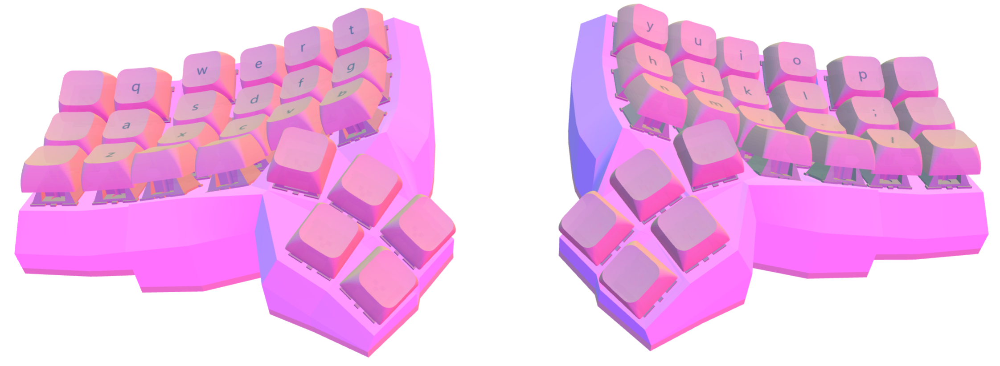

# My Personal Keyboard

I just started my journey with mechanical keyboards, using the Corne V4.1, and it has been fantastic. However, I quickly realized there were things that could be even better.

The issues I have with the Corne keyboard are:
* The thumb cluster should only start at the end of the "V" key, because using the first key often causes me pain.
* The thumb cluster should have an additional key to simplify one-handed usage.

Not much, but enough to make me search for more alternatives :)

As an IDE programmer, I use a lot of keybindings, often with only one hand, so having flexibility is important.

After searching for alternatives (one option could be the Kyria), I decided to design my own wireless keyboard. I used [Cosmos](https://ryanis.cool/cosmos/beta) to design the case to my liking.

This is my first attempt at creating a keyboard, and it was easy, aside from some mistakes that took me forever to fix, including misspelling some letters in the code.

This repo contains the ZMK configuration for the board and the 3D case files.

The keyboard link: https://ryanis.cool/cosmos/beta#cm:CqABChUSBRCQcSATEgIgABIAOB5AgIaKwAcKGRIFEJBlIBMSAiAAEgMQsDsSBRCwayAoOAoKHhIFEJBZIBMSAiAAEgMQsC8SBRCwXyAoOAlAgPC8AgoPEgUQkE0gExICIAASADgdCg8SBRCQQSATEgIgABIAODEKGhIEEBAgExIGEKCACiAAEgIQMDgyQICGisAHGABA6IWgrvBVSLiD4MWABQqPAQorEhMQwIACQICAmAJIwpmglZC8AVBDEhJAgIDMAkjCmaCVkLwBUIYBWDo4CAoVEhAQQECAgCBI0JWA3ZD1A1ALUJ4CCicSEBBAQICA+AFI5pn8p5ALUFcSEUCAgKQDSPCZxLXQMFB0WJUBUH8KA1CCAhgCIgoIyAEQyAEYACAAQMuL/J/QMUitkdyNwZMGGIQgIgMg1AyCAQECWEhoAA==

After coming from QMK, which is fantastic with VIAL, ZMK was intimidating to set up at first. But then I discovered [this keymap editor](https://nickcoutsos.github.io/keymap-editor/), which is fantastic. ZMK also solved all my issues with QMK, like timeless [home row mods](https://github.com/urob/zmk-config), and much more... I even start to think if I can flash my Corne with ZMK.