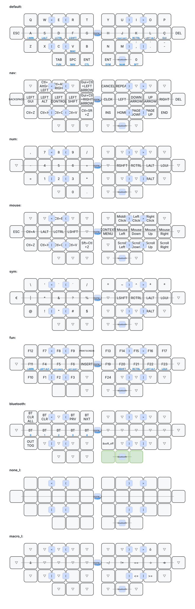

# 🌌 Cosmos HK - Custom 38-Key Keyboard


## 🗺️ Interactive Visual Keymap



Welcome to the official repository for the **Cosmos HK (unsplithk)**—a personal, compact, un-split 38-key hand-wired wireless keyboard designed for maximum efficiency, ergonomics, and seamless compatibility with Portuguese (PT) operating system layouts.

Powered by [ZMK Firmware](https://zmk.dev/) running on a `nice_nano_v2` controller, this layout features home-row modifiers, tap-dance punctuation shortcuts, conditional layers, custom symbol macros, and localized ZMK behaviors.

---

## ✨ Key Features & Enhancements

*   **⚡ Tap-Dance Punctuation**: Standard punctuation keys double up as common symbols on a quick double-tap, eliminating the need for layer switches:
    *   `,` $\rightarrow$ `;` (Semicolon)
    *   `.` $\rightarrow$ `:` (Colon)
    *   `-` $\rightarrow$ `_` (Underscore)
*   **🔄 Home-Row Repeat Key**: ZMK's `&key_repeat` is placed at the physical **`U`** position on the Nav layer. Hold the Nav thumb (SPACE) and tap `U` to repeat the last pressed key or macro as many times as you like.
*   **🖱️ Native Mouse Layer (Tri-Layer)**: Hold both the **Nav** (Layer 1) and **Num** (Layer 2) thumb keys simultaneously to automatically trigger the **Mouse Layer** (Layer 3) with mouse pointer and scrolling movements.
*   **✍️ Localized `caps_word`**: Customized Portuguese continue-list including `PT_UNDERSCORE`, `PT_MINUS`, and `PT_SINGLE_QUOTE`. Typographical hyphens, underscores, or apostrophes (such as in *d'água*) will not deactivate `caps_word` capitalization.
*   **💎 Custom Symbol Macros**: Dedicated macro layer providing quick, delay-buffered access to Portuguese characters (`ã`, `õ`) and development symbols (`->`, `=>`, `==`, `!=`, `<=`, `>=`).
*   **🌐 Wireless Multi-Device Bluetooth**: Seamless profiles switching for up to 5 devices, built-in battery/power management, and automatic Bluetooth/USB output toggle.

---

## 🧠 Layout Philosophy & Design Choices

This custom 38-key layout is structured around a specific philosophy tailored for software engineering, intensive IDE utilization, and bilingual writing:

*   **💻 Built for Software Engineering**: Modern software development requires a massive volume of keyboard shortcuts. The home-row modifier configuration allows you to trigger complex combinations (such as `Ctrl+Alt+Shift+Key`) naturally without wrist fatigue or strain.
*   **⚡ High-Priority Function Keys (Fun Layer)**: For software engineers, the **Fun Layer (F1-F24)** is crucial—even more important than a mouse layer! Debugging steps, refactoring commands, compiler commands, and test runners rely heavily on function keys. This layout prioritizes a complete F-key cluster easily accessible through your home-row mod-tap thumb keys.
*   **🇵🇹 Seamless Bilingual Writing (PT & EN)**: Even though most daily typing and coding are written in English, full native support for Portuguese letters is deeply integrated. Custom tap-dances, mod-morphs, and macro clusters provide effortless access to Portuguese letters (`Ç`, `ã`, `õ`, accented vowels, etc.) and punctuation, keeping both programming and native Portuguese writing completely fluent.
*   **🎨 Visual Customization via Keymap Editor**: To simplify changes, this ZMK keymap is kept perfectly formatted and compatible with [Nick Coutsos' Online Keymap Editor](https://nickcoutsos.github.io/keymap-editor/). You can visually load this repository's layout in the web browser, customize key assignments graphically, and compile behaviors seamlessly while keeping the ZMK code structure clean.

---

## 🛠️ ZMK Development Conventions

*   **Portuguese Key Mappings**: ZMK keymap standard uses Portuguese localized configurations from `keys_pt.h`. Standard US keycodes compile directly into their corresponding Portuguese OS positions (e.g. `SLASH` acts as `-`/`_`).
*   **Automatic Remote Builds**: Firmware builds are fully automated using GitHub Actions. Any commit pushed to the `master` branch will trigger `.github/workflows/build.yml` using `build.yaml` configurations.
*   **Local Build**:
    To set up the ZMK environment and build locally, please follow the [ZMK Developer Setup Instructions](https://zmk.dev/docs/development/setup), then compile with the `west` tool:
    ```bash
    west build -d build/unsplithk -p -b nice_nano_v2 -- -DSHIELD=unsplithk
    ```
    The compiled binary will be placed at `build/unsplithk/zephyr/zmk.uf2`.

---

*Handcrafted with ❤️ for maximum mechanical writing pleasure.*