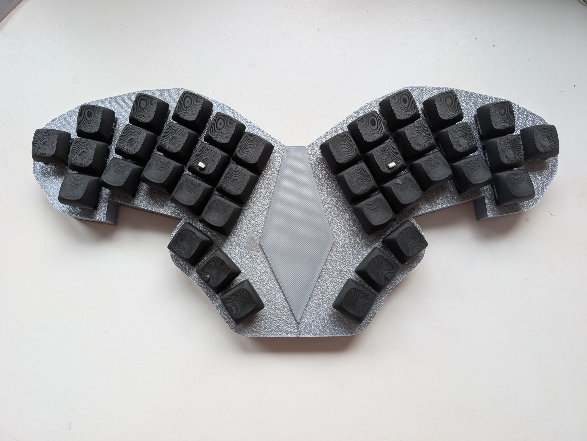

# My Personal Keyboard

A simple un-split 38 key keyboard, v2, designed to have minimal keys form my taste. 
It is a ZMK basd handwired wireless keyboard. 

The layout was produced using Ergogen and the case was then modeled in a 3D software.